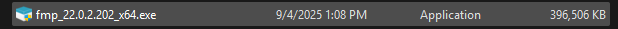
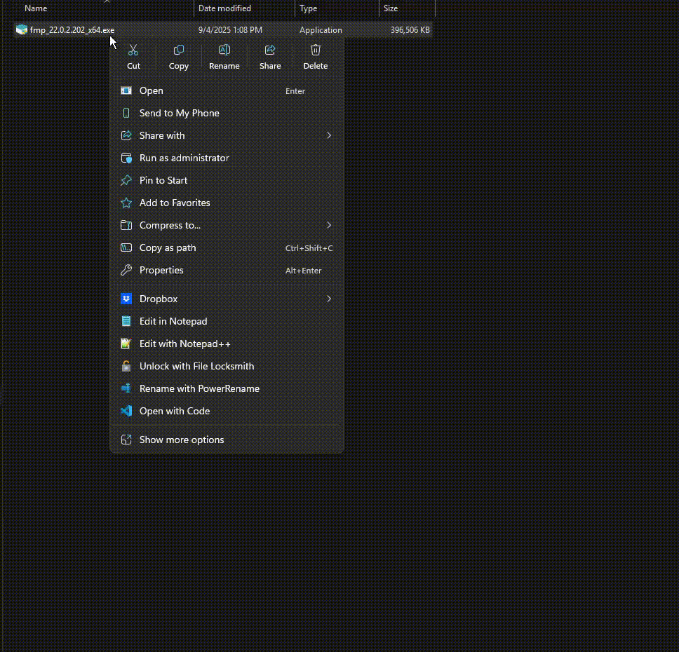
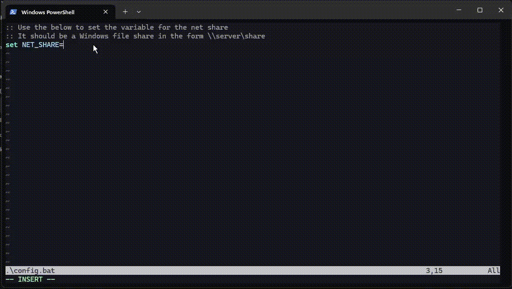

# Project Title

Simple overview of use/purpose.

## Description

An in-depth paragraph about your project and overview of use.

## Getting Started

### Dependencies

* 7zip
* Windows 10/11

### Installing

1) Find the FileMaker executable installer for your platform. It will often be the x64 executable directly received from Claris.



2) Extract the executable using 7zip to gain access to its contents in directory form, then copy the extracted directory to a location accessible to all network users.



3) Download the repo and edit the config file to reflect extraction directory

```bash
git clone https://github.com/spiritualhost/fm_install.git
```

The repo can be downloaded using the "Download ZIP" option under the code dropdown as well, bash and git are both unnecessary.

The config file will be used later in the script runtime to connect to the head directory where the FileMaker files are now located. For example, if the extracted directory made in Step 2 was placed in `\\netshare\quelaag` and the directory name from Step 2 didn't change, the config file would be changed to reflect `\\netshare\quelaag\fmp_22.0.2.202_x64`.



4) Download the repo to the user's PC


### Executing program

* How to run the program
* Step-by-step bullets
```
code blocks for commands
```

## Help

Any advise for common problems or issues.
```
command to run if program contains helper info
```

## Authors

Contributors names and contact info

ex. Dominique Pizzie  
ex. [@DomPizzie](https://twitter.com/dompizzie)

## Version History

* 0.2
    * Various bug fixes and optimizations
    * See [commit change]() or See [release history]()
* 0.1
    * Initial Release

## License

This project is licensed under the [NAME HERE] License - see the LICENSE.md file for details

## Acknowledgments

Inspiration, code snippets, etc.
* [awesome-readme](https://github.com/matiassingers/awesome-readme)
* [PurpleBooth](https://gist.github.com/PurpleBooth/109311bb0361f32d87a2)
* [dbader](https://github.com/dbader/readme-template)
* [zenorocha](https://gist.github.com/zenorocha/4526327)
* [fvcproductions](https://gist.github.com/fvcproductions/1bfc2d4aecb01a834b46)